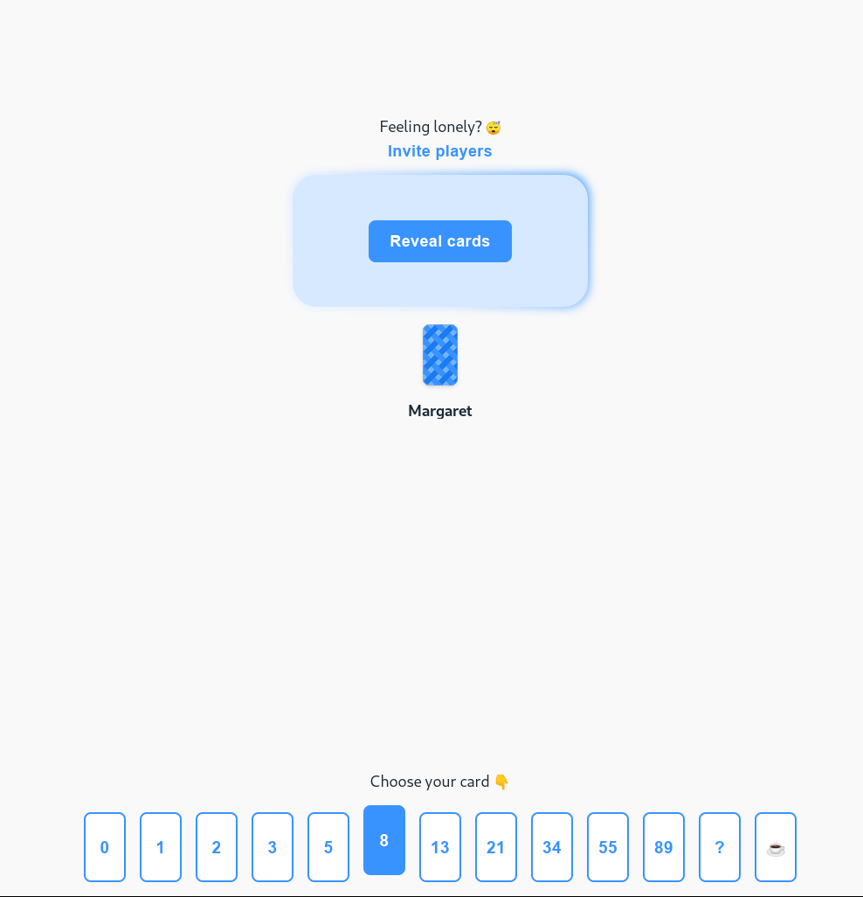

# Planning Poker Platform

The aim of the project is to create a platform for playing [planning 
poker](https://en.wikipedia.org/wiki/Planning_poker).

The game should proceed as follows:

1. One of the users (the room administrator) opens the website and receives a
   unique, alphanumeric room ID. He has to provide his username, and then he
   can join the room.
2. It should be possible to use the application by multiple teams at the same
   time.
3. The administrator can share a link to the room (including the room ID in the
   URL) with all participants of the planning poker session.
4. Every participant must provide their username upon joining. The list of
   participants is publicly available to everyone in the room.
5. Every participant sees voting cards containing numbers. We'll use the
   modified Fibonacci sequence cards: 1, 2, 3, 5, 8, 13, 20, 40. User can click
   on them; the selected number should be highlighted. The user should only be
   able to choose one card at a time, but he can change his
   vote.
6. The participant list shows which of the participants have already voted.
   However, their votes are not public yet.
7. The room administrator can show all votes. Then they are visible to all users.
8. The room administrator can clear all votes after voting is over.

**Optional**: Make it possible to protect the room with password.

## Tech stack

* Django: https://www.djangoproject.com/
* Django Channels: https://channels.readthedocs.io/en/latest/
* HTMX with websockets extension: https://htmx.org/extensions/web-sockets/
* pytest: https://docs.pytest.org/en/
* tailwindCSS (https://tailwindcss.com/) or chota (https://jenil.github.io/chota/)

## What we pay attention to

* Easy installation process, clear instructions in `README.md`
* The entire project development process (feature branches, merge requests)
* Valuable commit messages
* Functionality: the app should work
* Unit tests
* Usage of linters and code formatters
* The design of the application is not the most important, but it should be
  pleasant to use
